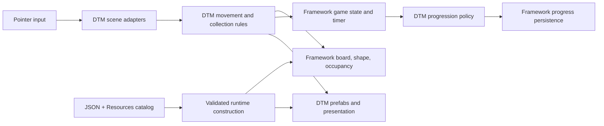
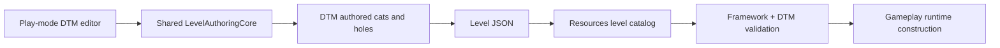

# Drop The Man

Drop The Man is a playable Unity puzzle prototype built on
[Puzzle Framework](https://github.com/GameplaySystem/PuzzleFramework). The player drags colored,
multi-cell holes across a board, collects matching cats, fills each hole to its required capacity,
and completes the level before an optional timer expires. The prototype is also the first concrete
consumer used to test which systems belong in the reusable framework.

## Key Features

- continuous pointer dragging constrained by footprint, board bounds, blocked cells, and occupancy
- matching-color collection during movement
- capacity derived from the authored hole footprint
- asynchronous cat approach/fall/shrink presentation with moving-hole socket tracking
- eight configured hole shapes with authored quarter-turn orientations
- modular URP board visuals, stencil apertures, color materials, and board-size camera framing
- JSON-authored levels loaded through an ordered Resources catalog
- validated runtime construction and prefab spawning from authored data
- load, play, win/fail, restart, next-level, replay, and campaign-resume flows
- versioned local progression with a separate Editor play-mode profile
- a dedicated play-mode level editor for board size, blocked cells, cats, holes, colors, rotation,
  JSON import, and JSON export
- three authored prototype levels

## Gameplay / Demo

Open `Assets/Scenes/DropTheManDevTest.unity` and enter Play Mode. Drag a hole with the primary
mouse button. A cat is eligible only when its color matches, its cell is reached during valid
movement, and the hole still has capacity. A level win is accepted after all required holes
complete, then progression is saved before the player advances.

## Architecture Overview

| System | Responsibility |
| --- | --- |
| Framework board and occupancy | Stores coordinates, cell structure, hole footprints, cats, blockers, and occupancy facts. |
| Framework interaction | Provides generic drag, snap, swept movement, and clearance primitives. |
| DTM runtime controller | Applies color, collection, capacity, completion, and outcome rules. |
| Content and construction | Loads the framework level envelope, interprets DTM payload data, validates it, and creates runtime objects. |
| Runtime flow | Uses framework game-state/timer services while DTM owns exact win, replay, and campaign policy. |
| Presentation | DTM owns cat animation, hole completion, materials, prefabs, camera behavior, HUD, and DOTween timing. |
| Progression | Framework persists versioned progress; DTM decides unlock order, replay behavior, resume, and looping. |
| Level editor | Shared framework authoring state plus DTM-specific cat/hole tools and payload conversion. |

## Architecture Diagram



The scene adapters translate Unity input and views into framework requests. The framework stores
generic state and validates reusable operations; DTM decides whether a cat can be collected, when a
hole is complete, when a level is won, and when progress should be saved. The diagram emphasizes
that ownership boundary instead of exposing every repository dependency.

## Framework vs. Game-Specific Code

| Reusable Puzzle Framework | Drop The Man |
| --- | --- |
| grid coordinates, board cells, footprints, occupancy, walls | cats, holes, sockets, and capacity meaning |
| drag/sweep/snap and structural clearance | matching-color collection and hole movement policy |
| level envelope, catalog, JSON transport, construction context | DTM payload schema, validation, prefab selection, and spawning |
| game-state and timer lifecycle | completion rules, exact outcome timing, restart/next/replay policy |
| color identity and modular board planning | concrete materials, stencil hole visuals, animation, HUD, and camera |
| authoring core, picking, placement, rotation, erase | cat/hole tools, warned prune-on-resize, and DTM JSON mapping |

## Reusable Systems Demonstrated

This prototype originally proved the framework's grid, occupancy, drag, content, construction,
runtime-flow, color, board-visual, and persistence foundations. It now also consumes the shared live
authoring core extracted after Color Block Escape supplied a second editor use case.

The same systems behave differently in CBE: DTM collects matching cats into capacity-bearing holes,
while CBE moves solid blocks toward matching exits and progressively releases occupancy. That
difference is why the framework exposes mechanics and facts instead of puzzle-specific rules.

## Level Creation / Editor Tooling

Open `Assets/Scenes/DropTheManLevelEditor.unity` and enter Play Mode.

| Input | Action |
| --- | --- |
| `O` | blocked-cell mode |
| `M` | cat placement mode |
| `H` | hole placement mode |
| `R` | rotate an already placed hole when valid |
| `0`–`9` | choose a configured color slot |
| Left click | apply the selected authoring action |
| Right click | erase where the current tool supports it |

The editor uses `GridCellAnchor.Center`, matching DTM's board visuals. Board resize keeps the
existing warned prune behavior. Save/load preserves the established DTM JSON format.



The tool exists to create and revise test levels without manually editing scene objects or JSON,
while keeping gameplay runtime construction as the authority.

## Technical Decisions

1. **Hole and cat rules stay in DTM.** Their meaning is specific to this puzzle and would couple the
   framework to one game.
2. **Movement and occupancy are composed from framework services.** DTM adds collection policy
   around generic board queries instead of embedding collection inside grid code.
3. **Authored content and runtime objects are separate.** JSON remains stable while runtime
   construction creates mutable state and concrete prefabs.
4. **Completion follows accepted gameplay facts.** A visual overlap or animation start does not
   decide collection, hole completion, or victory.
5. **Editor migration preserved the game workflow.** DTM adopted the shared live authoring core
   without changing its JSON, visuals, tools, or prune-on-resize policy.

## Performance Considerations

- Board movement and collection queries use logical cells and footprints rather than Rigidbody
  collision as gameplay authority.
- Scene-level controllers sample input and advance flow; logical cats and holes do not each own a
  separate `Update` loop.
- DOTween sequences are stopped on teardown and restart so stale animation callbacks cannot mutate a
  new session.
- The project does not publish frame-time, memory, or device benchmark claims yet.
- Object pooling is not presented as an implemented DTM feature.

## Project Structure

```text
Assets/
  GameModules/
    Runtime/       DTM gameplay, scene adapters, presentation, authoring
    Editor/        Setup utilities for DTM assets and scenes
    Levels/        Game-owned level data helpers
    Tests/         Prototype Edit Mode tests
  Resources/
    DropTheMan/Levels/   Shipped JSON levels
  RuntimeAssets/        Board, cat, hole, material, and animation assets
  Scenes/
    DropTheManDevTest.unity
    DropTheManLevelEditor.unity
Packages/
  manifest.json         Immutable Puzzle Framework dependency
docs/                   DTM rules, designs, and implementation handoffs
```

## Technologies

- Unity `6000.3.17f1`
- C#
- Universal Render Pipeline `17.3.0`
- DOTween Core
- Unity Recorder `5.1.6`
- Unity Test Framework
- Puzzle Framework installed through a full Git commit SHA

## Current Status

The current systems-showcase MVP is development-complete. Core gameplay, runtime construction,
three levels, progression, presentation integration, and level authoring are implemented. Final
player-facing UI/art polish, target-device testing, aspect-ratio acceptance, and a distributable
portfolio build remain deferred. DTM stays active as a framework regression target.

The latest shared-authoring migration verification passed all 35 DTM Edit Mode tests in a clean
Unity project copy.

## What I Built / Role

This is my independent portfolio engineering project. I designed and directed the gameplay
architecture, reviewed and integrated implementations, built and debugged movement, collection,
authoring, progression, and presentation systems, and own the content pipeline and test strategy.

## Running the Project

1. Clone the repository.
2. Open the repository root with Unity `6000.3.17f1`.
3. Allow Unity Package Manager to resolve the pinned Puzzle Framework Git dependency.
4. Open `Assets/Scenes/DropTheManDevTest.unity`.
5. Enter Play Mode and drag a hole with the primary mouse button.

Git must be available to Unity. A neighboring framework checkout is not required. The shipped
levels load from `Assets/Resources/DropTheMan/Levels`. To use the editor, open
`Assets/Scenes/DropTheManLevelEditor.unity` instead.

Run prototype tests through **Window > General > Test Runner > EditMode**.

## Documentation

- [MVP rules](docs/DropTheManMVPRules.md)
- [Movement and collection rules](docs/DropTheManMovementAndCollectionRules.md)
- [Runtime integration](docs/DropTheManRuntimeIntegrationDesign.md)
- [Level editor design](docs/DropTheManLevelEditorDesign.md)
- [Progression design](docs/DropTheManProgressionDesign.md)
- [Publication audit](docs/PublicationReadinessReport.md)

## Rights and Publication

This is a portfolio inspection project rather than an open-source package. No license is granted
for project-owned code or assets. Third-party components retain their own terms; see
[THIRD_PARTY_NOTICES.md](THIRD_PARTY_NOTICES.md).
